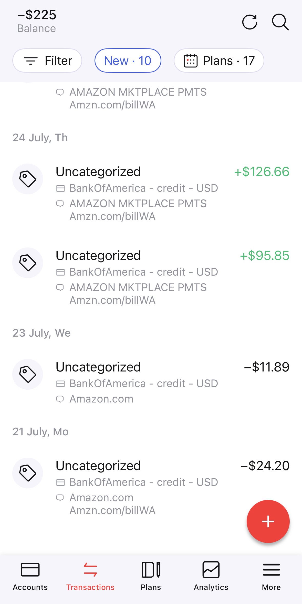

# Zenmoney US bank integration

Sync USA banks transactions with https://zenmoney.app/



# Requirement
- [NodeJS](https://nodejs.org/en) v22.17 or newer

## Usage

```bash
git clone https://github.com/AKosmachyov/zenmoney-us-bank-integration
cd zenmoney-us-bank-integration
```

### Sign in and download transactions from Zenmoney

```bash
ZEN_USER='username' ZEN_PWD='password' node --experimental-transform-types ./src/main.ts
```

or create environment variables

```bash
cat <<EOF > .env
ZEN_USER="username"
ZEN_PWD="password"
EOF

node --experimental-transform-types --env-file=.env ./src/main.ts
# or
npm start
```

## TODO:
- [] Increase test coverage (`npm test`)
- [] CLI Menu or UI (to select File and link with Bank account)
- [] Investigate `simplefin.org` sync option
- [] Setup e2e for getting balance changes (using Cypress, Playwright, Puppeteer)

## Integration

- PayPal - download QIF format from [link](https://www.paypal.com/reports/dlog)
- Bank of America (BofA) - download any QIF file from [link](https://www.bankofamerica.com) Menu -> Accounts -> scroll to Activity -> Download button
- American Express (Amex) - download CSV from [link](https://global.americanexpress.com/activity) -> Download -> select "csv"

## Other integration options
- [Plaid](https://plaid.com) - can be opened for personal use.
  - Balance: 0.10$ per call
  - Transactions: $0.30 per connected account/month
  - Transactions Refresh: $0.12 per successful call
- [simplefin](https://beta-bridge.simplefin.org) - haven't tested and found that on Reddit.
  - Use [MX](https://www.mx.com/) for connecting to financial institutions.
  - Connect up to 25 institutions
  - $1.50 per month, or $15 per year

## Usefull links
- [ZenMoney API documentation](https://github.com/zenmoney/ZenPlugins/wiki/ZenMoney-API)
